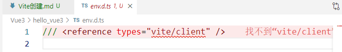

1.使用vite创建vue
  npm config set registry=https://registry.npmmirror.com
2.选择预设

3.env.d.ts标红说明缺少依赖

​	**npm i**：安装全部依赖 (项目目录下)

​	报错换源：npm config set registry https://registry.npmmirror.com/

		// 第一种镜像
		npm config set registry https://registry.npmmirror.com/
		// 第二种镜像 淘宝镜像
		npm config set registry https://registry.npm.taobao.org/
		// 第三种镜像 官方镜像
		npm config set registry https://registry.npmjs.org
4.入口文件：index.html

5.运行项目npm run dev

6.安装插件：npm i vite-plugin-vue-setup-extend -D

在vite.config.ts中引入插件

